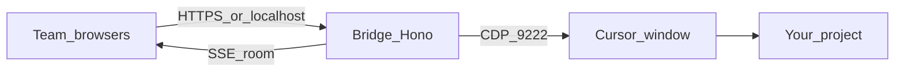

# Cursor Web Bridge

> Password-gated collaborative web room for a **local Cursor Agent**. Point it at *your* workspace, share one agent session with the team, and work from the browser (or phone via Ngrok) without each person needing the IDE.

A password-protected local web chat, connected to the **Cursor IDE via CDP** (default) or to a `@cursor/sdk` agent (optional). Any team attaches **their own project** and works together on the same agent.

## What it is

A shared browser room that talks to the **Cursor Agent already open** on the host machine.

It is not a clone of the IDE chat and it **does not** sync with other Cursor windows. In CDP mode the panel injects into the visible Agent composer and mirrors the reply. In SDK mode it starts a parallel session (`Agent.create` / `Agent.resume`).

What the room provides:

- Login with a **team password + display name**
- A single real-time transcript (late joiners see history)
- Live typing in the composer (last-writer-wins)
- Live audio/video in the panel (WebRTC mesh)
- Agent activity (Exploring, tools, Planning) above the composer
- Downloads for `/tmp/...` paths the agent mentions
- One turn at a time — no race on the composer

Point `CURSOR_CWD` and `CURSOR_CDP_TARGET` at the folder/window of **your** repository. The bridge does not assume a specific project.

## Why it exists

The Cursor Agent is powerful on one person's desktop. Everyone else is locked out: they cannot see the transcript, send the next prompt, download the zip the agent left in `/tmp`, or follow tool activity without VNC, Meet, or “send me a screenshot”.

This project exists to **open that session** — behind a password — to anyone who needs to collaborate on the same agent, in the same workspace, without each person installing the IDE or spending a separate API key.

## Where it helps

- **Pair / mob with a single agent** — one host keeps Cursor open; the team drives from the panel
- **Group review and diagnosis** — product, support, and engineering see the same investigation
- **Onboarding** — someone follows the agent without installing Cursor
- **On-call** — phone or another PC via Ngrok + password
- **Handoff** — room history survives refresh and late join

## Advantages

| Approach | What you get | What you give up |
| --- | --- | --- |
| **This bridge (CDP)** | Uses the IDE session/subscription; own web room; presence; live; artifacts | Needs Cursor open with a debug port; UI selectors can change |
| `@cursor/sdk` / API only | Parallel session, does not touch the IDE | API key; history separate from the chat you were already using |
| Telegram-style CDP bridges (CursorRemote, Gantry, etc.) | Control the local IDE | The channel is a messenger app, not a team room with live A/V and downloads |

In short: **one agent, one workspace, several people in the browser**.

## How it works



1. The host starts the bridge on the machine where Cursor is open.
2. Cursor needs `--remote-debugging-port=9222`.
3. `CURSOR_CDP_TARGET` selects the window whose title contains the workspace folder name.
4. `POST /api/chat` injects the prompt into the Agent and publishes tokens on the room bus.
5. Every authenticated client receives the same stream on `GET /api/events`.

## Quick start (local)

Prerequisites: **Node.js 20+**, Cursor installed, [Ngrok](https://ngrok.com/) if you will expose it to the team, and `zip` on PATH (folders under `/tmp` without a sibling zip).

```bash
git clone https://github.com/glira/cursor-web-bridge.git
cd cursor-web-bridge
cp .env.example .env
```

Edit `.env`:

- `BRIDGE_PASSWORD` — a strong room password
- `BRIDGE_SESSION_SECRET` — a long secret for the cookie
- `CURSOR_CWD` — **absolute** path of the workspace the agent should use
- `CURSOR_CDP_TARGET` — name that appears in the Cursor window title (usually the folder name)

```bash
npm install
npm run dev
# or: ./start-local.sh   (bridge + ngrok)
```

Open `http://127.0.0.1:8787`, sign in with **name + password**, and send a test prompt.

### Attach Cursor (CDP mode, default)

The flag only applies to the **first** process. Fully quit Cursor and launch it again:

```bash
# Linux (adjust the binary / AppImage for your install)
cursor --no-sandbox \
  --remote-debugging-port=9222 \
  --remote-allow-origins=http://localhost:9222
```

Then:

1. **File → Open Folder** on the team's project workspace
2. Open an **Agent → New Chat** in that window (dedicated to the bridge)
3. Confirm CDP: `curl http://127.0.0.1:9222/json/version`
4. Confirm the bridge: `curl http://127.0.0.1:8787/api/health`

Health should show `ok: true`, `hasChatInput: true`, and a `targetTitle` that matches `CURSOR_CDP_TARGET`. If only another window exists, health fails on purpose — open the right folder.

### Remote team (Ngrok)

With the bridge running, in another terminal (or via `./start-local.sh`):

```bash
ngrok http 8787
```

1. Share the `https://….ngrok-free.app` URL **and** the password (not just the link)
2. Each person signs in with a distinct name
3. The host machine must stay on: the agent runs **locally**

HTTPS is required off localhost for camera/mic.

## Collaborative room

1. Each member signs in with the same `BRIDGE_PASSWORD` and a name (e.g. Ana).
2. The panel opens `EventSource` on `/api/events` and receives snapshot, tokens, drafts, presence, artifacts, and WebRTC signaling.
3. `POST /api/chat` runs the turn and **publishes on the bus**.
4. `POST /api/draft` mirrors typed text (ephemeral).
5. If the agent is busy, new sends get HTTP 409 with who is driving.

### Live typing

Whoever is typing broadcasts the draft (~120ms). If you have focus in the box, the remote draft **does not** overwrite it; you see a “Someone is typing…” pill.

### Live audio/video

In the **Live** panel: join, allow mic/camera, mute, leave. Signaling is in the room; media is peer-to-peer. Best up to ~6 people. Difficult NAT → configure TURN (`RTC_TURN_*`).

### Message metadata

- User: `Name · 23:04`
- Assistant running: `Agent · by Ana · started 23:04 · running… · 42s`
- Assistant done: `Agent · by Ana · 23:04 → 23:09 · 5m 12s · finished`

### Full capture (CDP)

The bridge **does not** end the turn just because the first bubble stabilized. While generating/activity is present, it extends the deadline (`CDP_TIMEOUT_MS`) up to `CDP_MAX_TIMEOUT_MS`. After idle, it waits a grace period (~25s). If the cap is hit while the agent is still active, the panel marks `timeout` (partial).

## `/tmp` downloads

When the agent prints paths such as `/tmp/report.zip` or `file:///tmp/folder/`, the bridge records the path, attaches it to the message, and shows a download button. Only paths **mentioned in the session** are downloadable. Symlinks that escape `/tmp` are blocked.

## Environment variables

| Var | Description |
| --- | --- |
| `PORT` | HTTP port (default `8787`) |
| `BRIDGE_PASSWORD` | Room password |
| `BRIDGE_SESSION_SECRET` | Session cookie secret |
| `BRIDGE_BACKEND` | `cdp` (default) or `sdk` |
| `CURSOR_CDP_URL` | CDP HTTP URL (default `http://127.0.0.1:9222`) |
| `CURSOR_CDP_TARGET` | Substring of the Cursor window title (e.g. folder name) |
| `CURSOR_API_KEY` | API key (`sdk` mode only) |
| `CURSOR_CWD` | Absolute workspace path |
| `CURSOR_MODEL` | SDK model (default `composer-2.5`) |
| `CDP_POLL_MS` | DOM poll interval (default `400`) |
| `CDP_TIMEOUT_MS` | Soft window while the agent works (default `600000`) |
| `CDP_MAX_TIMEOUT_MS` | Absolute CDP turn cap (default `2700000` = 45 min) |
| `RTC_STUN_URLS` | STUN for WebRTC |
| `RTC_TURN_URLS` / `RTC_TURN_USER` / `RTC_TURN_PASS` | Optional TURN |

## Scripts

```bash
npm run dev        # watch
npm start          # simple production
npm run typecheck  # tsc --noEmit
./start-local.sh   # bridge + ngrok
```

## Security

- Anyone with **password + URL** talks to an agent that can read/edit `CURSOR_CWD` and download registered `/tmp` artifacts.
- Cookie is `HttpOnly` + `SameSite=Lax`; `Secure` on HTTPS. It carries `displayName` + `clientId`.
- Login has a simple per-IP rate limit.
- Do not share `.env` or log `CURSOR_API_KEY` / the password.
- Details in [SECURITY.md](SECURITY.md).

## Limitations

- CDP mode uses the Agent chat **visible** in the IDE; open a dedicated New Chat
- Cursor UI selectors/heuristics can break on updates
- Attachments/images from the panel work better in `sdk` mode
- One turn at a time in the room
- Live A/V is a P2P mesh (best up to ~6); without TURN it can fail on some NATs
- Old cookies (no name) require a new login

## License

[MIT](LICENSE)
