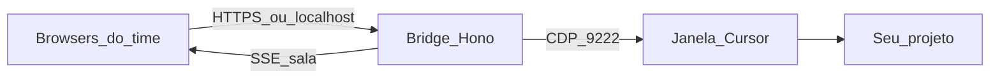

# Cursor Web Bridge

> Password-gated collaborative web room for a **local Cursor Agent**. Point it at *your* workspace, share one agent session with the team, and work from the browser (or phone via Ngrok) without each person needing the IDE.

Chat web local com senha, ligado ao **Cursor IDE via CDP** (padrão) ou a um agente `@cursor/sdk` (opcional). Qualquer time acopla o **próprio projeto** e trabalha em grupo no mesmo agente.

## O que é

Uma sala compartilhada no navegador que fala com o **Cursor Agent que já está aberto** na máquina host.

Não é um clone do chat do IDE e **não** sincroniza com outras janelas do Cursor. No modo CDP o painel injeta no composer do Agent visível e espelha a resposta. No modo SDK sobe uma sessão paralela (`Agent.create` / `Agent.resume`).

O que a sala oferece:

- Login com **senha do time + nome de exibição**
- Transcript único em tempo real (quem entra depois vê o histórico)
- Digitação ao vivo no composer (last-writer-wins)
- Live áudio/vídeo no painel (WebRTC mesh)
- Atividade do agente (Exploring, tools, Planning) acima do composer
- Downloads dos paths `/tmp/...` citados pelo agente
- Um turno por vez — sem corrida no composer

Aponte `CURSOR_CWD` e `CURSOR_CDP_TARGET` para a pasta/janela do **seu** repositório. O bridge não assume um projeto específico.

## Por que existe

O Cursor Agent é forte no desktop de uma pessoa. O resto do time fica de fora: não vê o transcript, não manda o próximo prompt, não baixa o zip que o agente deixou em `/tmp`, e não acompanha as tools sem VNC, Meet ou “me manda um print”.

Este projeto nasceu para **abrir essa sessão** — com senha — para quem precisa colaborar no mesmo agente, no mesmo workspace, sem cada um instalar o IDE ou gastar uma API key à parte.

## Onde colabora

- **Pair / mob com um único agente** — um host deixa o Cursor aberto; o time dirige pelo painel
- **Review e diagnóstico em grupo** — produto, suporte e dev veem a mesma investigação
- **Onboarding** — alguém acompanha o agente sem instalar Cursor
- **Plantão** — celular ou outro PC via Ngrok + senha
- **Handoff** — o histórico da sala sobrevive a refresh e late join

## Vantagens

| Abordagem | O que você ganha | O que perde |
| --- | --- | --- |
| **Este bridge (CDP)** | Usa a sessão/assinatura do IDE; sala web própria; presença; live; artefatos | Precisa do Cursor aberto com debug port; seletores da UI podem mudar |
| Só `@cursor/sdk` / API | Sessão paralela, sem mexer no IDE | API key; histórico separado do chat que você já estava usando |
| Bridges CDP tipo Telegram (CursorRemote, Gantry, etc.) | Controlam o IDE local | Canal é o app de mensagem, não uma sala de time com live e downloads |

Resumo: **um agente, um workspace, várias pessoas no browser**.

## Como funciona



1. O host sobe o bridge na máquina onde o Cursor está aberto.
2. O Cursor precisa de `--remote-debugging-port=9222`.
3. `CURSOR_CDP_TARGET` escolhe a janela cujo título contém o nome da pasta do workspace.
4. `POST /api/chat` injeta o prompt no Agent e publica tokens no barramento da sala.
5. Todos autenticados recebem o mesmo stream em `GET /api/events`.

## Quick start (local)

Pré-requisitos: **Node.js 20+**, Cursor instalado, [Ngrok](https://ngrok.com/) se for expor para o time, comando `zip` no PATH (pastas em `/tmp` sem zip irmão).

```bash
git clone https://github.com/<sua-conta>/cursor-web-bridge.git
cd cursor-web-bridge
cp .env.example .env
```

Edite o `.env`:

- `BRIDGE_PASSWORD` — senha forte da sala
- `BRIDGE_SESSION_SECRET` — segredo longo para o cookie
- `CURSOR_CWD` — path **absoluto** do workspace que o agente deve usar
- `CURSOR_CDP_TARGET` — nome que aparece no título da janela Cursor (em geral o nome da pasta)

```bash
npm install
npm run dev
# ou: ./start-local.sh   (bridge + ngrok)
```

Abra `http://127.0.0.1:8787`, entre com **nome + senha**, envie um prompt de teste.

### Ligar o Cursor (modo CDP, default)

A flag só vale no **primeiro** processo. Feche o Cursor por completo e abra de novo:

```bash
# Linux (ajuste o binário / AppImage da sua instalação)
cursor --no-sandbox \
  --remote-debugging-port=9222 \
  --remote-allow-origins=http://localhost:9222
```

Depois:

1. **File → Open Folder** no workspace do projeto do time
2. Abra um **Agent → New Chat** nessa janela (dedicado ao bridge)
3. Confirme o CDP: `curl http://127.0.0.1:9222/json/version`
4. Confirme o bridge: `curl http://127.0.0.1:8787/api/health`

O health deve mostrar `ok: true`, `hasChatInput: true` e `targetTitle` batendo com `CURSOR_CDP_TARGET`. Se só existir outra janela, o health falha de propósito — abra o folder certo.

### Time remoto (Ngrok)

Com o bridge no ar, em outro terminal (ou via `./start-local.sh`):

```bash
ngrok http 8787
```

1. Compartilhe a URL `https://….ngrok-free.app` **e** a senha (não só o link)
2. Cada pessoa entra com um nome distinto
3. A máquina host precisa ficar ligada: o agente roda **localmente**

HTTPS é obrigatório fora de localhost para câmera/mic.

## Sala colaborativa

1. Cada membro entra com a mesma `BRIDGE_PASSWORD` e um nome (ex.: Ana).
2. O painel abre `EventSource` em `/api/events` e recebe snapshot, tokens, drafts, presença, artefatos e sinalização WebRTC.
3. `POST /api/chat` processa o turno e **publica no barramento**.
4. `POST /api/draft` espelha o texto digitado (efêmero).
5. Se o agente estiver ocupado, novos envios recebem HTTP 409 com quem está dirigindo.

### Digitação ao vivo

Quem digita transmite o rascunho (~120ms). Se você estiver com foco na caixa, o draft remoto **não** sobrescreve; aparece o pill “Fulano está digitando…”.

### Live áudio/vídeo

No painel **Live**: entrar, autorizar mic/câmera, mute, sair. Sinalização na sala; mídia peer-to-peer. Melhor até ~6 pessoas. NAT difícil → configure TURN (`RTC_TURN_*`).

### Metadados na mensagem

- User: `Nome · 23:04`
- Assistant em execução: `Agente · por Ana · iniciado 23:04 · em execução… · 42s`
- Assistant concluído: `Agente · por Ana · 23:04 → 23:09 · 5m 12s · finished`

### Captura completa (CDP)

O bridge **não** encerra o turno só porque o primeiro bubble estabilizou. Enquanto houver generating/activity, estende a deadline (`CDP_TIMEOUT_MS`) até `CDP_MAX_TIMEOUT_MS`. Depois de idle, espera um grace period (~25s). Se o teto estourar com o agente ativo, o painel marca `timeout` (parcial).

## Downloads de `/tmp`

Quando o agente imprime caminhos como `/tmp/relatorio.zip` ou `file:///tmp/pasta/`, o bridge registra o path, associa à mensagem e mostra o botão de download. Só paths **mencionados na sessão** são baixáveis. Symlinks que saiam de `/tmp` são bloqueados.

## Variáveis

| Var | Descrição |
| --- | --- |
| `PORT` | Porta HTTP (default `8787`) |
| `BRIDGE_PASSWORD` | Senha da sala |
| `BRIDGE_SESSION_SECRET` | Segredo do cookie de sessão |
| `BRIDGE_BACKEND` | `cdp` (default) ou `sdk` |
| `CURSOR_CDP_URL` | HTTP do CDP (default `http://127.0.0.1:9222`) |
| `CURSOR_CDP_TARGET` | Trecho do título da janela Cursor (ex.: nome da pasta) |
| `CURSOR_API_KEY` | API key (só modo `sdk`) |
| `CURSOR_CWD` | Path absoluto do workspace |
| `CURSOR_MODEL` | Modelo SDK (default `composer-2.5`) |
| `CDP_POLL_MS` | Intervalo de poll DOM (default `400`) |
| `CDP_TIMEOUT_MS` | Janela soft enquanto o agente trabalha (default `600000`) |
| `CDP_MAX_TIMEOUT_MS` | Teto absoluto do turno CDP (default `2700000` = 45 min) |
| `RTC_STUN_URLS` | STUN para WebRTC |
| `RTC_TURN_URLS` / `RTC_TURN_USER` / `RTC_TURN_PASS` | TURN opcional |

## Scripts

```bash
npm run dev        # watch
npm start          # produção simples
npm run typecheck  # tsc --noEmit
./start-local.sh   # bridge + ngrok
```

## Segurança

- Quem tiver **senha + URL** fala com um agente que lê/edita o `CURSOR_CWD` e baixa artefatos `/tmp` registrados.
- Cookie `HttpOnly` + `SameSite=Lax`; `Secure` em HTTPS. Carrega `displayName` + `clientId`.
- Login tem rate limit simples por IP.
- Não compartilhe `.env` nem logue `CURSOR_API_KEY` / senha.
- Detalhes em [SECURITY.md](SECURITY.md).

## Limitações

- Modo CDP usa o chat Agent **visível** no IDE; abra um New Chat dedicado
- Seletores/heurísticas da UI do Cursor podem quebrar em updates
- Anexos/imagens pelo painel: melhor no modo `sdk`
- Um turno por vez na sala
- Live A/V é mesh P2P (melhor até ~6); sem TURN pode falhar em alguns NATs
- Cookies antigos (sem nome) exigem novo login

## Licença

[MIT](LICENSE)
